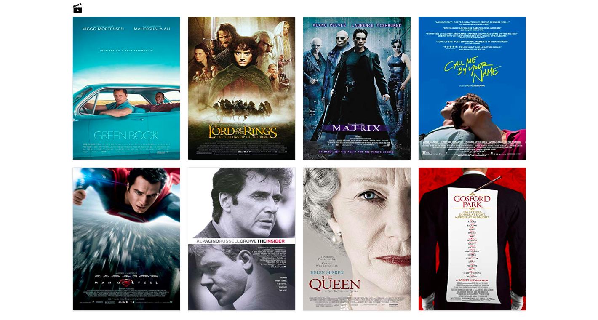

# React on Rails | Full Stack Movie App

The Full Stack Movie App is a single page application that uses [The Open Movie Database API](http://www.omdbapi.com/) as a template for the hard coded data in the database. Alternatively, this application can utilize the external API to request movie data. Either way, the  client side application will be served by a back-end which will have the ability to persist data.

## Instructions

- Fork and clone **this repo**
- Run `bundle install` in the root directory to install all the required gems
- Set up the database, `rails db:create`
- Create the database tables by running the migration, `rails db:migrate`
- Seed the database, `rails db:seed`
- Navigate to the client directory and run `npm install` to set up the React application
- Navigate back to the root directory and start the server, **foreman start -p 3000**
- Both the Rails server and the React server will start.

#### Component Architecture
    
    /src/...
    ├── App (renders the Header, Footer and MoviesList)
    ├── MoviesList (renders all movies)
    ├── MovieItem (renders one movie)
    ├── CreateMoviePage (create a new movie)
    ├── UpdateMoviePage (update a movie's information)
    ├── MovieForm (adds new movies to the db)
    ├── Header (includes navbar)
    ├── Footer *(optional)*
